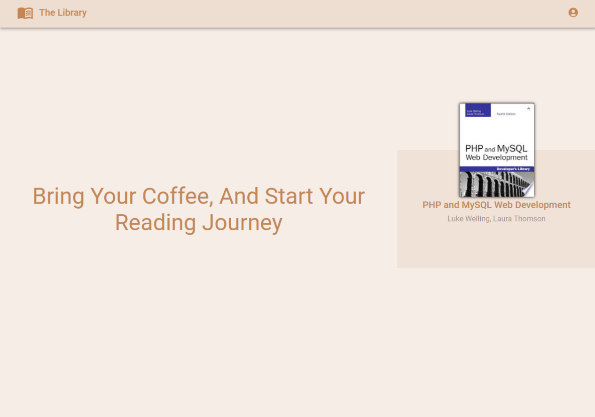

# The Library

## Overview

The Library is a project that can help book lovers to organize their books. Its idea is derived from good reads as a resource of inspiration, and it gets the data from Google Books API.

## Features

- It shows you a variety of books related to web development (Specifying categories will be implemented soon)
- You can search for the books you want by using the search bar and entering the title, or keyword for the book
- Click on the card to go to the book page and get more information about it
- hover on the card so you can specify the status for it like Will Read, Reading, Read
- From the challenges page, you can click on the ADD NOTE button to add your notes about the book, and it will be shown on the book page

## Running The Project Locally

**Live Preview:** https://adhamelhabashy.github.io/Library/

1. First, make sure you have npm installed
2. clone this repo by using
   `git clone https://github.com/adhamElhabashy/Library.git`
3. go to the project folder by using
   `cd Library`
4. install Project Dependencies By using
   `npm install`
5. start development by using
   `npm run dev`

## Dependencies

- [React](https://react.dev/)
- [Redux Toolkit](https://redux-toolkit.js.org/)
- [Material UI](https://mui.com/material-ui/)
- [React Router Dom](https://www.npmjs.com/package/react-router-dom)
- [Axios](https://axios-http.com/)
- [Vite](https://vitejs.dev/)
- [Google Books API](https://developers.google.com/books/)
